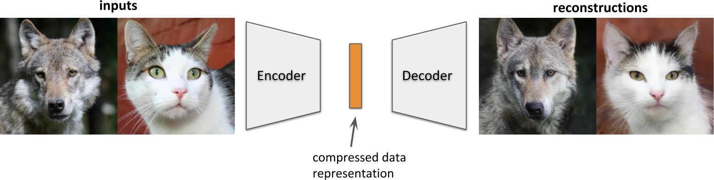
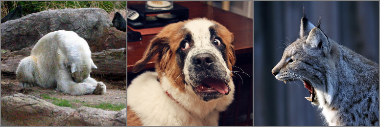

# Autoencoders


A collection of autoencoder models in PyTorch.

## Quickstart

Install

```
git clone https://github.com/edflow/autoencoders.git
cd autoencoders
pip install -e .
```

and run a reconstruction demo:

```
edexplore -b configs/demo.yaml
```

To reconstruct your own images, just add them to the `assets` folder.

## Usage

```
import autoencoders

model = autoencoders.get_model("bigae_animals")
```

Currently available models are

- `bigae_animals`: Trained on `128x128x3` animal images from `ImageNetTrain`.
- `bigae_animalfaces`: Trained on `128x128x3` animal images from `AnimalFacesSharedTrain`.

Models implement `encode`, which returns a Distribution, and `decode` which
returns an image. A minimal working example is

```
import torch
import numpy as np
from PIL import Image
import autoencoders

model = autoencoders.get_model("bigae_animals")

x = Image.open("assets/fox.jpg")                      # example image
x = torch.tensor(np.array(x)/127.5-1.0)               # h,w,RGB in [-1,1]
x = x[None,...].transpose(3,2).transpose(2,1).float() # batch,RGB,h,w
p = model.encode(x)                                   # Distribution
z = p.sample()                                        # sampled latent code
xrec = model.decode(z)                                # batch,RGB,h,w
```

We also include BigGAN models, `biggan_128`, `biggan_256`, but they do not
implement `encode`.  `biggan_128` takes a sample from a normal distribution of
size 120 and `biggan_256` of size 256. Both require an additional class label
input (integer in `range(1000)`) for `decode`. You can start a demo for them
by starting

```
streamlit run autoencoders/demo.py
```

and selecting `sample` from the Demo dropdown menu. Adjust `z_shape` to 140 if
you select the `biggan_256` model.

## Data

Import dataset classes:

```
from autoencoders.data import <DatasetSplit>
```

Take a look:

```
edexplore --dataset autoencoders.data.<DatasetSplit>
```

Possible values for `<DatasetSplit>`:

- `ImageNetTrain`, `ImageNetValidation`
- `ImageNetAnimalsTrain`, `ImageNetAnimalsValidation`
- `AnimalFacesTrain`, `AnimalFacesTest`
- `AnimalFacesSharedTrain`, `AnimalFacesSharedTest`
- `AnimalFacesRestrictedTrain`, `AnimalFacesRestrictedTest`
- `AwA2Train`, `AwA2Test`

### ImageNet

Note that the datasets will be downloaded (through [Academic
Torrents](http://academictorrents.com/)) and prepared the first time they are
used. Since ImageNet is quite large, this requires a lot of disk space and
time. If you already have ImageNet on your disk, you can speed things up by
putting the data into `${XDG_CACHE}/autoencoders/data/ILSVRC2012_{split}/data/`
(which defaults to `~/.cache/autoencoders/data/ILSVRC2012_{split}/data/`), where `{split}` is
one of `train`/`validation`. It should have the following structure:

```
${XDG_CACHE}/autoencoders/data/ILSVRC2012_{split}/data/
├── n01440764
│   ├── n01440764_10026.JPEG
│   ├── n01440764_10027.JPEG
│   ├── ...
├── n01443537
│   ├── n01443537_10007.JPEG
│   ├── n01443537_10014.JPEG
│   ├── ...
├── ...
```

If you haven't extracted the data, you can also place
`ILSVRC2012_img_train.tar`/`ILSVRC2012_img_val.tar` (or symlinks to them) into
`${XDG_CACHE}/autoencoders/data/ILSVRC2012_train/` /
`${XDG_CACHE}/autoencoders/data/ILSVRC2012_validation/`, which will then be
extracted into above structure without downloading it again.  Note that this
will only happen if neither a folder
`${XDG_CACHE}/autoencoders/data/ILSVRC2012_{split}/data/` nor a file
`${XDG_CACHE}/autoencoders/data/ILSVRC2012_{split}/.ready` exist. Remove them
if you want to force running the dataset preparation again.


### AnimalFaces
This dataset was for example used in [FUNIT](https://nvlabs.github.io/FUNIT/).
It contains all 149 carnivorous mammal animal classes from the ImageNet
dataset. If this dataset is not available on your disk, the dataset will
automatically be build upon first use, following the cropping procedure as
described and implemented [here](https://github.com/nvlabs/FUNIT/). Note that
this requires that the `ImageNet` dataset is already present as described
above.

We provide two different splits of this dataset:

- The *"classic"* FUNIT split: Here, the train set contains images of
    119 animal classes, while the test set contains 30 *different* classes.
    - train split: `AnimalFacesTrain`
    - test split: `AnimalFacesTest`

- The *"shared"* split: `AnimalFacesShared`: Here, both the train and test split contain images of
    *all* 149 classes.
    - train split: `AnimalFacesSharedTrain`
    - test split: `AnimalFacesSharedTest`

An additional subset of `AnimalFacesShared`, which contains ten animal classes
chosen to be visually dissimilar, is available as:

- train split: `AnimalFacesRestrictedTrain`
- test split: `AnimalFacesRestrictedTest`

It consists of the following synsets:

- 'n02099601': 'golden retriever'
- 'n02114548': 'white wolf, Arctic wolf, Canis lupus tundrarum',
- 'n02117135': 'hyena, hyaena',
- 'n02119022': 'red fox, Vulpes vulpes',
- 'n02123159': 'tiger cat',
- 'n02127052': 'lynx, catamount',
- 'n02128757': 'snow leopard, ounce, Panthera uncia',
- 'n02129165': 'lion, king of beasts, Panthera leo',
- 'n02132136': 'brown bear, bruin, Ursus arctos',
- 'n02138441': 'meerkat, mierkat'


### ImageNetAnimals

This dataset contains the same images as `AnimalFaces`, but *without* cropping.
In this case, the split follows that of ImageNet itself. Note that this is
incompatible with the splits of AnimalFaces because the latter is a subset of
the ImageNet train split.

- train split: `ImageNetAnimalsTrain`
- test split: `ImageNetAnimalsValidation`


### AwA2
The [Animals with Attributes 2](http://cvml.ist.ac.at/AwA2/) dataset. Note that
our train and test split contain the same classes, which is different from the
original splits which contained disjoint animal classes.

Place (or symlink) data extracted from `AwA2-data.zip` into
`${XDG_CACHE}/autoencoders/data/AwA2/Animals_with_Attributes2`, or it will be
extracted from `${XDG_CACHE}/autoencoders/data/AwA2/AwA2-data.zip`, which will
be downloaded if not present.

### BigGAN
For convenience, we include datasets which provide inputs to BigGAN (or other
class conditional models). They consist of `n_train_samples`/`n_test_samples`
examples containing `z`, sampled from a (truncated, if `truncation` config value
is specified) normal distribution of shape `z_shape`, and `class`, a random
integer between `0` (inclusive) and `n_classes` (exclusive). Train split always
samples anew for each example, test split contains deterministic examples.

- train split: `TrainSamples`
- test split: `TestSamples`
